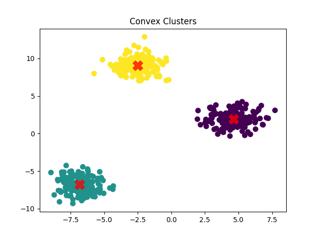
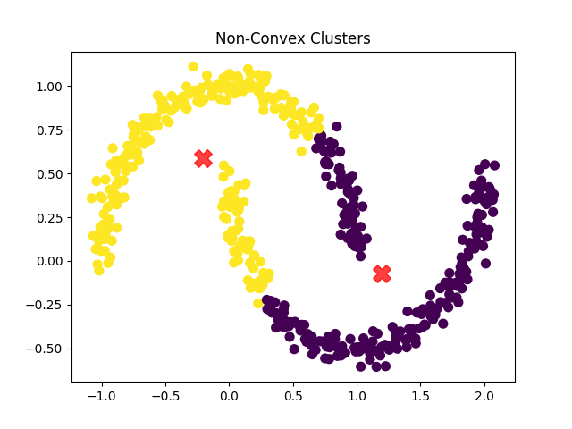
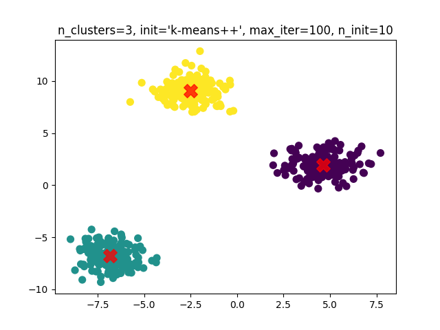
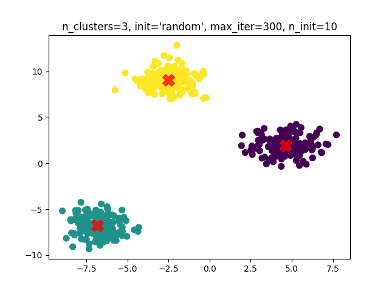
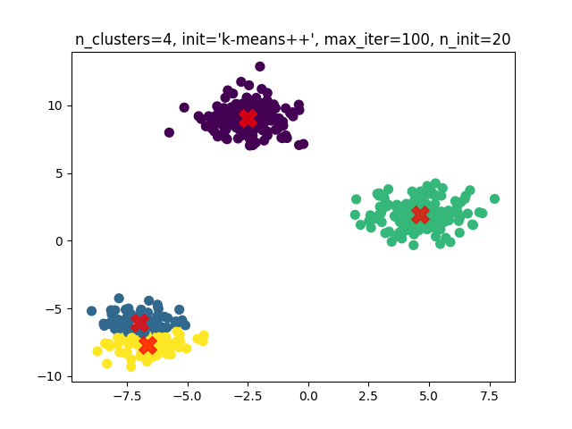
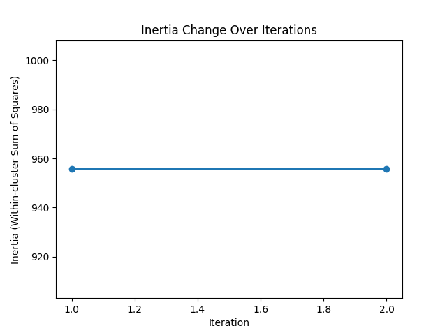

# Homework 3
## Theoretical Part

In this part we give describe K-means algorithm from theoretical standpoint. 

### Clustering

The aim of clustering is to group n objects into g homogeneous groups (elements within group are close). This task is classified as **unsupervised learning**, since nothing is known about classes prior.  

### K-Means

Let $X$ - set of samples. $|X| = N$. Our goal is to break them down into $K$ disjoint clusters $C$. 

Withing each cluster we will find it’s mean, called **centroid $\mu = \frac{\sum{c_i}}{|C|}$.** 

The idea is to minimize variance, called **inertia**, inside each cluster: $\sum{\min||x_i - \mu||^2}$

#### Algorithm

```python
Function KMeans(X, n_clusters, max_iter, tol):
  Initialize:
    Randomly select n_clusters points from X as initial centroids
    Set iteration counter to 0

  Repeat until convergence or iteration counter reaches max_iter:
    For each data point in X:
      Calculate distance to each centroid
      Assign the data point to the nearest centroid

    For each cluster:
      Update the centroid by calculating the mean of points assigned to it

    If the movement of all centroids is less than tol:
      Break the loop (convergence achieved)

    Increment iteration counter

  Output:
    Final centroids
    Cluster labels for each data point
```

#### Pros

- Always converges

#### Cons

- Assumes that clusters are convex. Will work bad for non-convex clusters

    <aside>
    <b>Definition</b>

    Cluster is convex iff any line segment joining two points within cluster remains inside cluster
    </aside>

- Assumes that clusters are isotropic. Will work bad for non-isotropic clusters, because points within a cluster that are far away from centroid will contribute to inertia too much.

    <aside>
    <b>Definition</b>

    Cluster is isotropic iff it has the same variance in all directions, i.e. if forms spherical shape around centroid (the same distance from centroid)
    </aside>

- Need to know number of clusters in advance.

## Practical Part

In the practical part we describe results obtained by experimenting with K-means algorithm.
Elapsed time results can be viewed in 'main.py' along with the source code.

### Examples of good and bad performance
#### Good Performance - Convex Data
As predicted by theory, K-means performs well on convex data. One can observe it on a picture below



#### Bad Performance - Non-Convex Data
For non-convex shapes, K-means is sub-optimal, since algorithm is "deceived" by inertias inside clusters 



### Trying Different Parameters
I tried 3 different parameters. It did not affect performance much. Of course, it took more time for more iterations. On the last picture, we are attempting to create 4 clusters. As a result, one cluster has been split into half. 





### Tracking Inertia
Here we are tracking change of inertia with each step of the algorithm
#### Convex Data
For convex and isotropic data inertia stays approximately the same. It happens, because in isotropic data point are evenly distanced from centroid, thus inertia is the same.



#### Non-Convex Data
For non convex data we observe a big change of inertia, since points distributed unevenly from a centroid.


