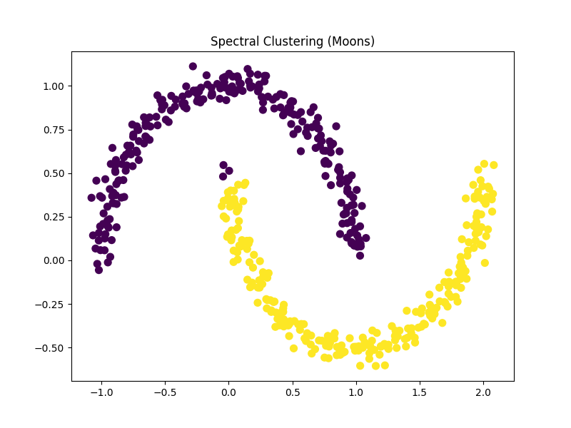
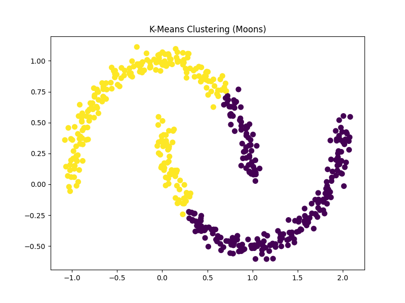
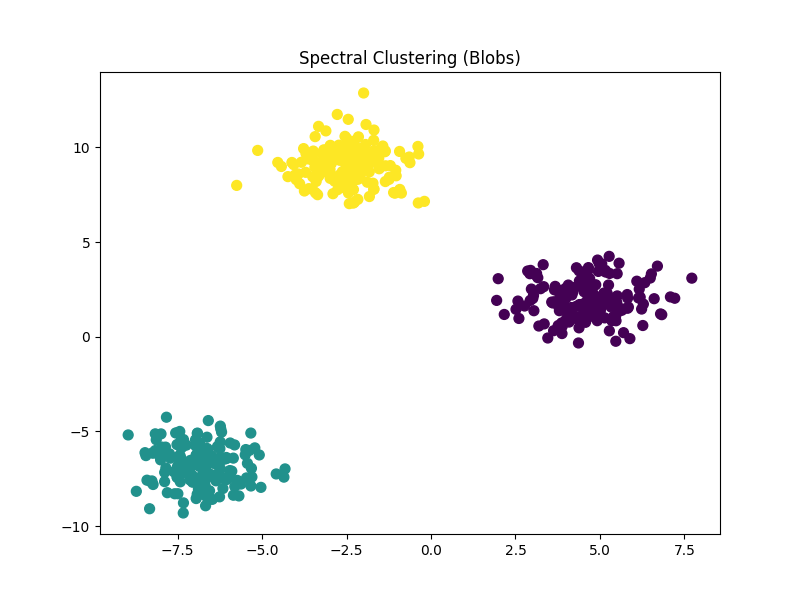

# Spectral Clustering Implementation

Here I demonstrate the use of **Spectral Clustering**. The implementation is compared against the traditional **K-Means** clustering method.

## Theory

### Spectral Clustering
Spectral Clustering transforms the dataset into a graph-based representation where data points are treated as nodes. It then applies graph partitioning techniques to find clusters. This method is particularly effective for datasets with non-convex clusters, such as moon-shaped data.

Key steps in Spectral Clustering:
1. **Affinity Matrix**: Represents similarity between data points using metrics such as RBF kernel or nearest neighbors.
2. **Graph Laplacian**: Computes the Laplacian matrix from the affinity matrix.
3. **Eigen Decomposition**: Extracts eigenvectors corresponding to the smallest eigenvalues.
4. **Clustering**: Applies k-means on the eigenvectors to find clusters.

### Parameters in Spectral Clustering
- `n_clusters`: Number of clusters to find.
- `affinity`: Method for constructing the affinity matrix (`rbf` or `nearest_neighbors`).
- `gamma`: Parameter for the RBF kernel, controlling how strongly points influence each other.

### Comparison with K-Means
#### Advantages:
- Can cluster non-convex shapes (e.g., moon-shaped data).
- Does not assume spherical clusters.
- More robust to initialization.

#### Disadvantages:
- Computationally expensive for large datasets.
- Requires additional parameters (e.g., `affinity` and `gamma`).

### Impact of Parameters
- **Affinity**: Choosing `nearest_neighbors` works well for graph-like structures, while `rbf` is better for dense data.
- **Gamma**: Larger values emphasize close neighbors, leading to finer clustering but might overfit.

## Results
1. **Moon-shaped data**:
    - Spectral Clustering outperforms K-Means due to its ability to handle non-convex shapes.
    
    
2. **Blob data**:
    - Both methods perform similarly as blobs are convex in shape.
    
    
