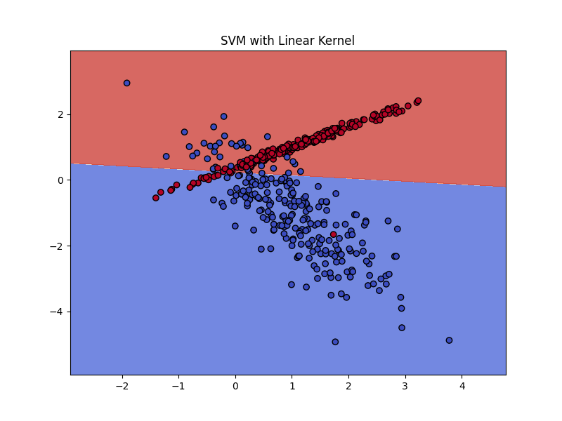
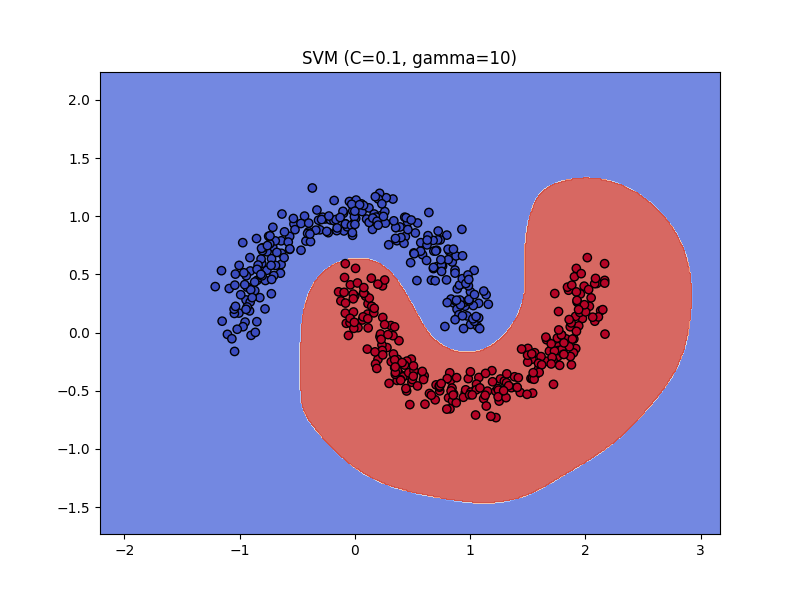
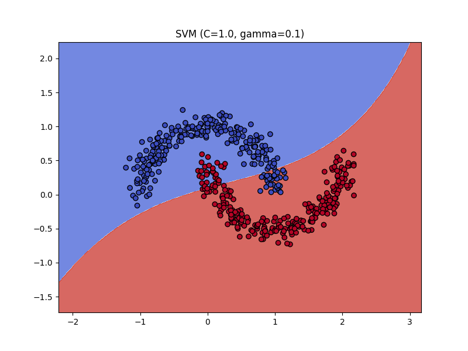
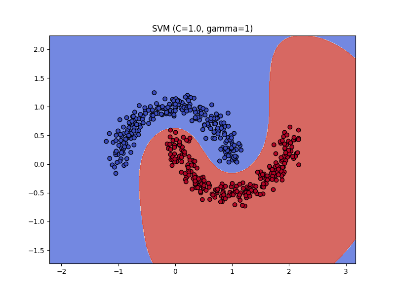
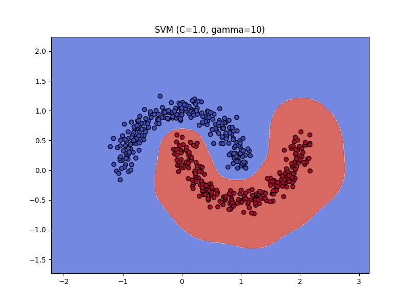
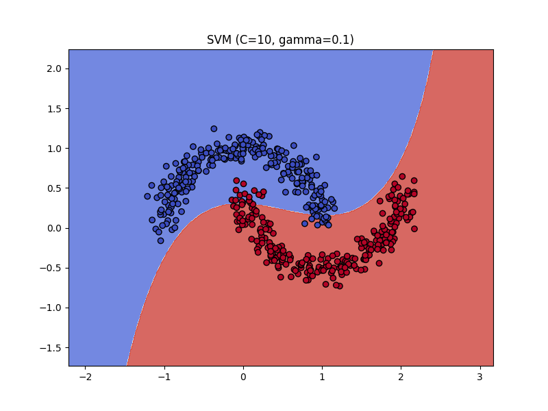
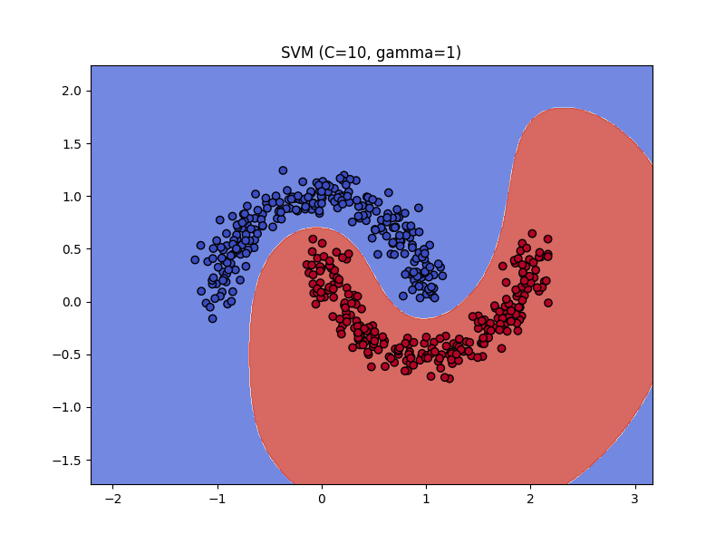

# SVM Implementation and Analysis

Here I experiment with **Support Vector Machines (SVM)** using synthetic datasets. I focused on understanding SVM parameters (`kernel`, `C`, `gamma`) and their impact on performance.

## Theory

### Support Vector Machines (SVM)
SVM is a supervised learning algorithm used for classification and regression. It aims to find the hyperplane that best separates classes in a high-dimensional space.

Key concepts:
1. **Hyperplane**: A decision boundary that separates classes.
2. **Support Vectors**: Data points closest to the hyperplane, defining its position.
3. **Margin**: The distance between the hyperplane and the nearest support vectors. SVM maximizes this margin for better generalization.

### Parameters in SVM
- **Kernel**: Transforms data into higher dimensions for better separability.
  - `linear`: Works well for linearly separable data.
  - `rbf`: Maps data into a radial feature space for non-linear separation.
- **C**: Controls the trade-off between maximizing the margin and minimizing misclassification. 
  - Smaller `C`: Larger margin, tolerates more misclassification.
  - Larger `C`: Smaller margin, less tolerant to misclassification.
- **Gamma**: Controls the influence of individual training points (only for `rbf` kernel).
  - Smaller `gamma`: Points have a broader influence.
  - Larger `gamma`: Points have a narrower influence.

## Results
### Dataset
Two datasets were used:
1. **Linearly separable data**: For testing SVM with the `linear` kernel.
2. **Moon-shaped data**: For testing SVM with the `rbf` kernel.

### Observations
1. **Linear Kernel**:
   - Suitable for linearly separable data.
   - Increasing `C` reduces misclassification but risks overfitting.

2. **RBF Kernel**:
   - Suitable for non-linear data like moon-shaped clusters.
   - Parameter `gamma` determines the smoothness of the decision boundary.
   - Parameter `C` controls the trade-off between margin and fit.

### Example Results
#### RBF Kernel:
- `C=1.0, gamma=0.1`: Smooth boundary, good generalization.
- `C=10.0, gamma=10`: Overfits, fits tightly around the training data.

### Comparison of Parameters
| Kernel | C       | Gamma   | Accuracy |
|--------|---------|---------|----------|
| Linear | 1.0     | N/A     | 0.92     |
| RBF    | 1.0     | 0.5     | 0.94     |
| RBF    | 10.0    | 10.0    | 0.85     |

## Boundary Plots

